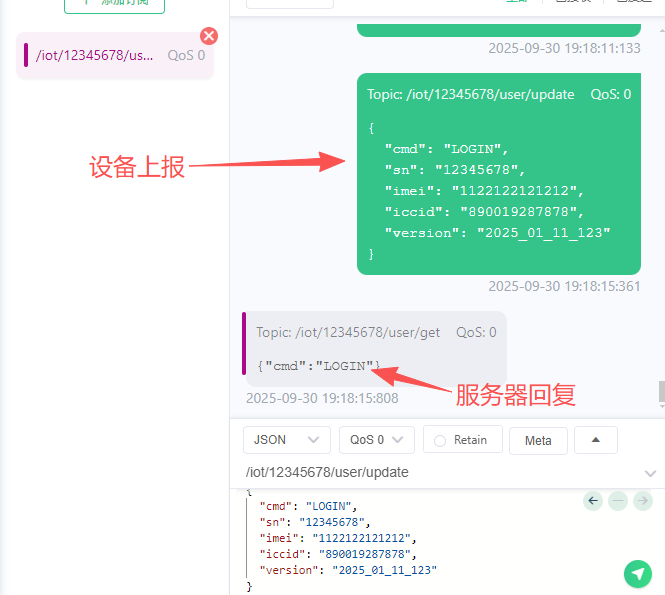
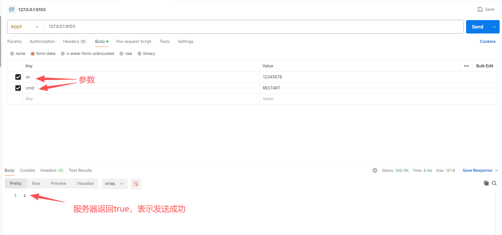
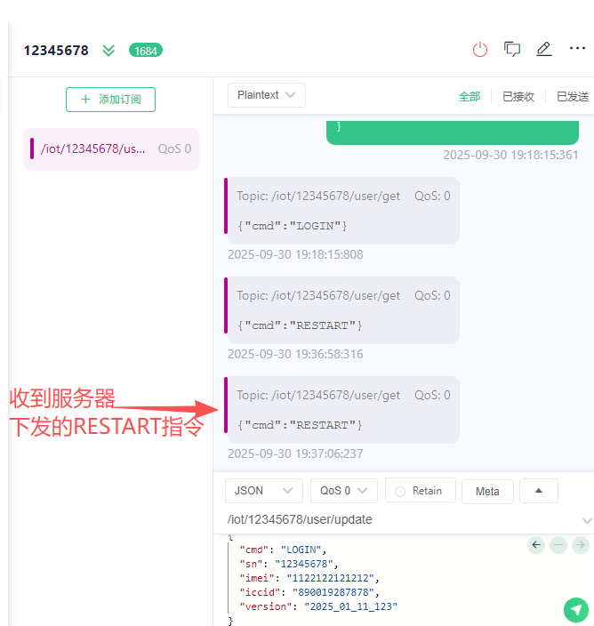
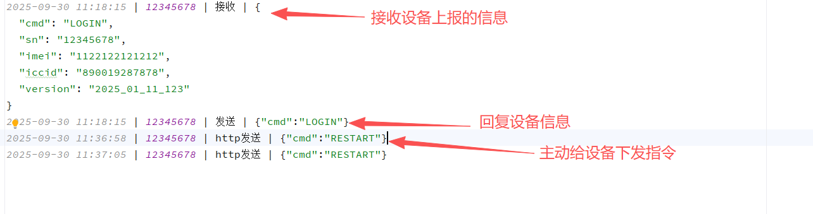
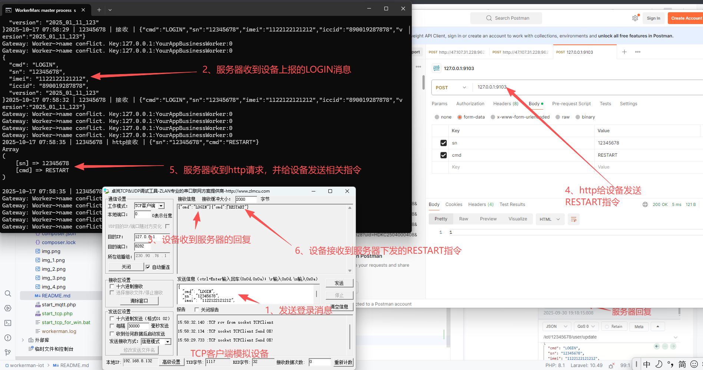

# 基于workerman的iot物联网系统
本项目是基于workerman开发的一套基础的物联网平台，可以实现设备的联网上线，日志记录，数据库操作，命令下发等功能。  
目前支持mqtt、TCP协议 
提供测试协议供了解本项目

##  安装和使用说明
1、克隆项目：`git clone git@github.com:ZhangYanqiang/workerman-iot.git`  
2、安装依赖： `composer install`  
3、配置mqtt服务端或TCP服务端端口，数据库，新建设备表  
4、在根目录创建目录 runtime/log  
5、启动mqtt： `php run start_mqtt.php 或 php run start_mqtt.php -d`    
   或启动tcp：`php run start_tcp.php 或 php run start_tcp.php -d`  
win系统启动，在命令行运行 php app\runmqtt\start_subscribe.php app\runmqtt\start_http.php  
  

_mqtt或tcp无需同时启动，需要那个启动那个即可_

## 项目介绍  
一个完整的物联网项目示意图如下，本项目仅实现红框中的部分

## 项目优势  

- 使用Eloquent ORM 操作数据库，具体使用请参考laravel文档
- 支持mqtt协议，tcp协议

## 本项目使用的测试设备协议
> 设备主动上报消息举例  
> 
> 设备登录： {"cmd": "LOGIN","sn": "12345678","imei": "1122122121212","iccid": "890019287878","version": "2025_01_11_123"}  
> 服务器回复 {"cmd": "LOGIN"}  
> 说明  
> cmd：当前的消息类型  
> SN：设备唯一编号  
> imei：通信模块的ID  
> iccid：物联网卡的id  
> version：硬件版本  
> 
> 服务器主动下发给设备  
> 
> 重启设备：{"cmd": "RESTART"}  
> 设备回复：{"cmd": "RESTART","code":1}  
> code: 重启结果 1-成功 0-失败

## 关于数据库
> 仅作举例，建一个设备表  
> 
> `CREATE TABLE `iot_device` (
`id` int NOT NULL AUTO_INCREMENT,
`sn` varchar(50) NOT NULL COMMENT '设备SN',
`status` tinyint NOT NULL DEFAULT '0' COMMENT '0-离线 1-在线',
`imei` varchar(50) DEFAULT NULL,
`iccid` varchar(50) DEFAULT NULL,
`version` varchar(50) DEFAULT NULL,
`created_at` datetime DEFAULT NULL,
`updated_at` datetime DEFAULT NULL,
`deleted_at` datetime DEFAULT NULL,
PRIMARY KEY (`id`),
UNIQUE KEY `device_sn` (`sn`,`deleted_at`)
) ENGINE=InnoDB DEFAULT CHARSET=utf8mb4 COLLATE=utf8mb4_0900_ai_ci;`

## 文件目录说明 
├─app         业务代码  
│  ├─models   数据模型---参考laravel ORM  
│  ├─runmqtt  启动目录，mqtt客户端，http客户端  
│  └─runtcp   TCP启动目录，tcp服务端，http客户端  
├─config      配置文件  
├─runtime     日志目录  
│  └─log  
└─vendor      依赖  

## 关于MQTT
> mqtt服务端使用EMQX做测试
>
> 设备上报消息主题为： "/iot/设备SN/user/update"  
> 设备订阅消息主题为： "/iot/设备SN/user/get"

## 测试方法
#### mqtt测试  
按使用说明启动项目后，在本地运行一个mqtt客户端（本文采用MQTTX）模拟设备  
如下图：  
设备SN为：12345678  
设备上报主题为：/iot/12345678/user/update  
设备订阅主题为：/iot/12345678/user/get  
  
模拟设备上报一条LOGIN信息后，立马收到服务器回复，设备表的信息会同步更新

  

#### http测试  
如下图，用postman发送一条http请求，根据配置文件，监听的是本机9103端口
  
如下图：模拟设备（MQTTX）收到相应指令  

## 日志记录

### TCP测试 
如下图：
- 1、`php run start_tcp.php` 启动tcp服务端
- 2、本地运行一个tcp客户端模拟设备，建立tcp连接后，发送LOGIN消息
- 3、服务器收到消息后，记录日志，更新设备表，并返回结果
- 4、tcp客户端中就可以看到服务端返回的LONGIN登录结果 
  
测试http，通过http主动给设备下发消息
- 5、用postman发送RESTART指令给服务器
- 6、如图，服务器收到http请求，记录日志，并给设备下发相关指令
- 7、设备收到服务器下发的指令
