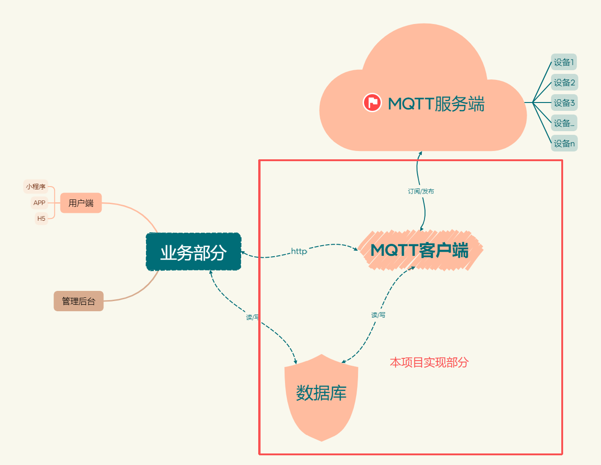

# 基于workman的iot物联网系统
本项目是基于workman开发的一套基础的物联网平台，可以实现设备的联网上线，日志记录，数据库操作，命令下发等功能。  
目前支持mqtt协议，可轻松扩展TCP协议，阿里云AMQP等协议  
提供测试协议供了解本项目

##  安装和使用说明
1、克隆项目：` dd`  
2、安装依赖： `composer install`  
3、配置mqtt服务端，数据库，新建设备表  
4、启动项目： `php run start_mqtt.php 或 php run start_mqtt.php -d `  

## 项目介绍  
一个完整的物联网项目示意图如下，本项目仅实现红框中的部分

## 项目优势  

- 使用Eloquent ORM 操作数据库，具体使用请参考laravel文档
- 以此项目为骨架，可以方便快捷的修改支持TCP协议，阿里云的AMQP协议等

## 本项目使用的测试设备协议
> 设备主动上报消息举例  
> 
> 设备登录： {"cmd": "LOGIN","sn": "12345678","imei": "1122122121212","iccid": "890019287878","version": "2025_01_11_123"}  
> 协议说明  
> cmd：当前的消息类型  
> SN：设备唯一编号  
> imei：通信模块的ID  
> iccid：物联网卡的id  
> version：硬件版本  
> 
> 服务器主动下发给设备  
> 
> 重启设备：{"cmd": "RESTART"}

## 关于MQTT
> mqtt服务端使用EMQX做测试  
> 
> 设备上报消息主题为： "/iot/设备SN/user/update"  
> 设备订阅消息主题为： "/iot/设备SN/user/get"
> 

## 关于数据库
> 仅作举例，建一个设备表  
> 
> `CREATE TABLE `iot_device` (
`id` int NOT NULL AUTO_INCREMENT,
`sn` varchar(50) NOT NULL COMMENT '设备SN',
`status` tinyint NOT NULL DEFAULT '0' COMMENT '0-离线 1-在线',
`imei` varchar(50) DEFAULT NULL,
`iccid` varchar(50) DEFAULT NULL,
`version` varchar(50) DEFAULT NULL,
`created_at` datetime DEFAULT NULL,
`updated_at` datetime DEFAULT NULL,
`deleted_at` datetime DEFAULT NULL,
PRIMARY KEY (`id`),
UNIQUE KEY `device_sn` (`sn`,`deleted_at`)
) ENGINE=InnoDB DEFAULT CHARSET=utf8mb4 COLLATE=utf8mb4_0900_ai_ci;`

## 文件目录说明
